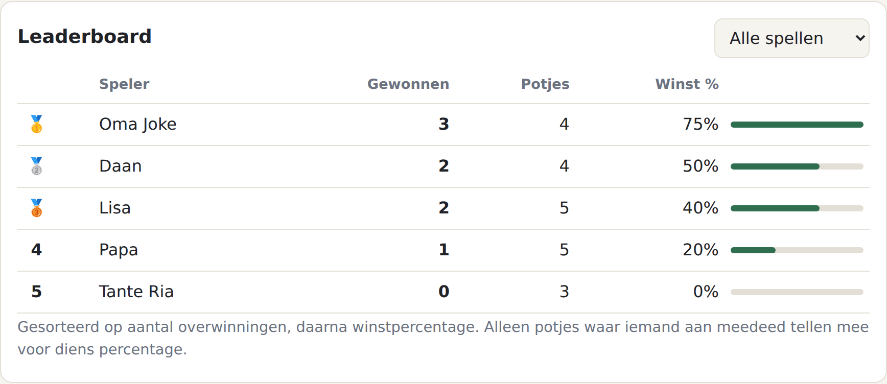
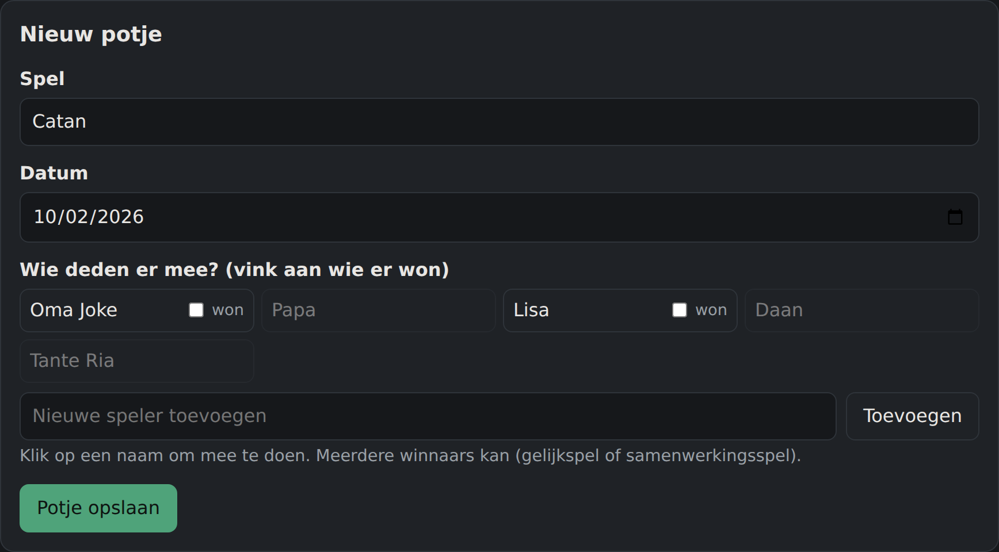
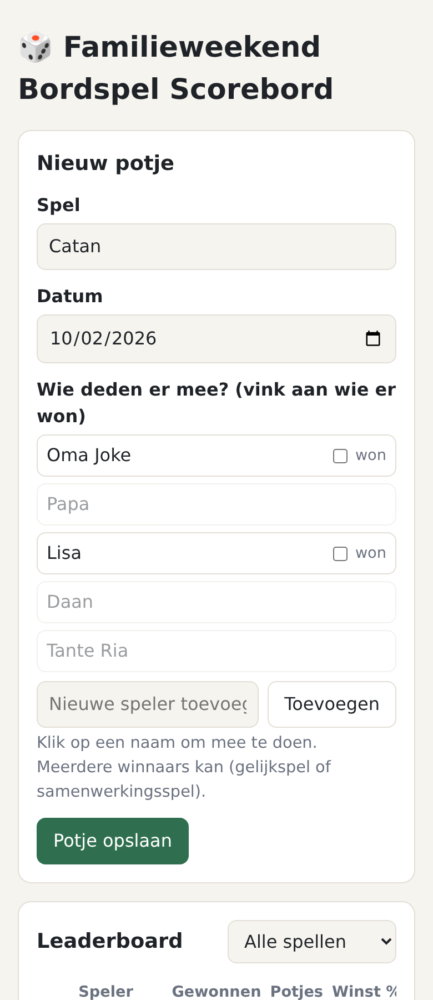

<div align="center">

# 🎲 Familieweekend Bordspel Scorebord

**Wie is écht de bordspelkampioen van de familie? Eindelijk zwart op wit.**

Een supersimpel scorebord voor GitHub Pages: vul in wie er meedeed, welk spel je speelde en wie er won.
Het leaderboard regelt de rest.

[](https://chrisvdalen.github.io/familieweekendbordspelshizzle/)




</div>

---

## ✨ Wat kan het?

| | |
|---|---|
| 🏆 **Eerlijk leaderboard** | Rangschikt op overwinningen, daarna op winstpercentage. Wie bij een potje niet meedeed, krijgt daar ook geen verlies voor. |
| 🎯 **Filter per spel** | Wie is de koning van Catan? Wie verliest altijd met Wingspan? Eén klik. |
| 👥 **Deelnemers per potje** | Tik op de namen die meededen en vink de winnaar aan. Dezelfde groep blijft staan voor het volgende potje. |
| 🤝 **Meerdere winnaars** | Gelijkspel of een coöperatief spel zoals Pandemic? Vink gewoon iedereen aan. |
| 📊 **Per-spel overzicht** | Hoe vaak is elk spel gespeeld en wie heeft het vaakst gewonnen. |
| 📜 **Geschiedenis** | Alle potjes op datum, met een knop om een vergissing te verwijderen. |
| 💾 **Export / import** | Back-up als JSON, of zet de stand over naar een ander apparaat. |
| 📱 **Telefoonvriendelijk** | Gemaakt om aan de keukentafel op je telefoon in te vullen, en ook in dark mode. |

<div align="center">

&nbsp;

</div>

## 🚀 Live zetten in 1 minuut

1. Ga naar **Settings → Pages** van deze repo.
2. Kies bij *Source* **Deploy from a branch**, en dan `master` en `/ (root)`.
3. Na ongeveer een minuut staat het op
   **https://chrisvdalen.github.io/familieweekendbordspelshizzle/**

Lokaal draaien? Open `index.html` gewoon in je browser. Er is geen build-stap.

## ⚠️ Belangrijk: waar staan de scores?

GitHub Pages is statisch: er is **geen server en geen database**. De scores worden opgeslagen in de
`localStorage` van de browser, dus **alleen op het apparaat waarop je ze invult**.

> [!TIP]
> **Aanpak voor het weekend:** laat één persoon de scores bijhouden op één telefoon.
> Klik aan het eind op **Exporteren** en commit het bestand als `data.json` in deze repo.
> Iedereen die de site daarna voor het eerst opent, krijgt die stand automatisch te zien.

> [!WARNING]
> Vullen twee mensen tegelijk op verschillende apparaten scores in, dan worden die **niet** samengevoegd.
> Een import vervangt de huidige gegevens volledig.

## 🗂️ Dataformaat

```json
{
  "players": ["Oma Joke", "Papa", "Lisa"],
  "matches": [
    {
      "game": "Catan",
      "date": "2026-10-02",
      "players": ["Oma Joke", "Papa", "Lisa"],
      "winners": ["Oma Joke"]
    }
  ]
}
```

## 🧱 Projectstructuur

```
├── index.html   ← de hele app: HTML, CSS en JS in één bestand
├── data.json    ← (optioneel) gedeelde startstand
└── docs/        ← screenshots voor deze README
```

<div align="center">

---

Gemaakt voor het familieweekend. Moge de beste winnen. 🎉

</div>
